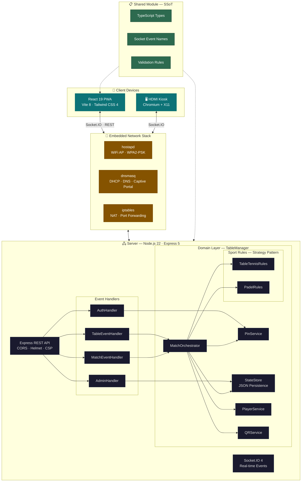
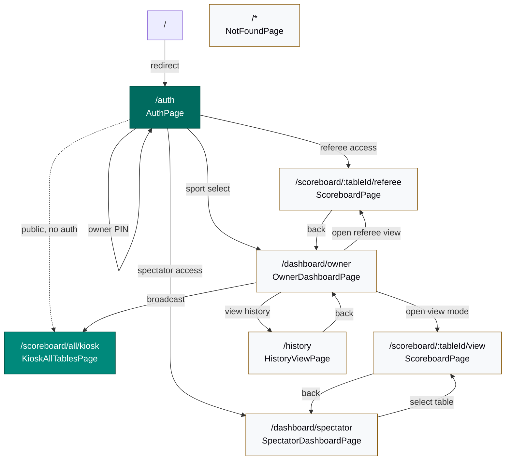

# rallyOS-hub

Real-time scoreboard system for rally events with multi-court support, multi-sport scoring (Table Tennis + Padel), PWA, offline capabilities, and embedded deployment on Orange Pi devices.

## System Architecture

RallyOS Hub is a standalone, real-time scoreboard server optimized for embedded deployment on single-board computers (SBCs) like the Orange Pi Zero 3. It operates as a TypeScript monorepo containing a React-based PWA frontend, an Express + Socket.IO backend, and a shared module serving as the Single Source of Truth (SSoT).

Multi-sport scoring is implemented via the **Strategy pattern** — server-side `SportRules` (TableTennisRules, PadelRules) and client-side `SportDisplayAdapter` (TableTennisDisplayAdapter, PadelDisplayAdapter) — enabling different scoring systems, display layouts, and match configuration per sport.



### Component Breakdown

| Component | Role | Key Technologies |
|-----------|------|-----------------|
| **Client (Frontend)** | React 19 PWA with atomic design (atoms, molecules, organisms, pages). Sport-specific display adapters for Table Tennis and Padel. i18n (es-AR / en-US). Offline-first via `vite-plugin-pwa`. | React 19, Vite 8, React Router v7, Tailwind CSS 4, i18next |
| **Server (Backend)** | Express 5 + Socket.IO 4 real-time engine. Clean, service-oriented: event handlers delegate socket payloads to the `TableManager`, which coordinates sub-services (`MatchOrchestrator`, `PlayerService`, `PinService`, `QRService`). Multi-sport scoring via Strategy pattern (`SportRules` interface → `TableTennisRules`, `PadelRules`). | Node.js 22, Express 5, Socket.IO 4, Pino logger |
| **Shared Module** | Monorepo package with TypeScript types (discriminated unions for multi-sport), validation limits, and event names. Ensures absolute synchronization of data formats between client and server. | TypeScript 6 |
| **Embedded Network Stack** | Orchestrated by deployment scripts to configure the Orange Pi as a standalone hub: `hostapd` broadcasts Wi-Fi, `dnsmasq` serves DHCP/DNS, `iptables` enforces captive portal, and Chromium drives the HDMI kiosk display. | hostapd, dnsmasq, iptables, Chromium, X11 |

### Embedded Network Stack

The Orange Pi becomes a self-contained tournament hub with no external internet required:

| Service | Role | Configuration |
|---------|------|---------------|
| **hostapd** | Broadcasts the RallyOS Wi-Fi SSID (`RallyOS-Table1`) for players to connect | WPA2-PSK, channel 6, 2.4 GHz |
| **dnsmasq** | DHCP server assigning IPs (192.168.4.100–200) and DNS resolving `rallyos-hub.local` → 192.168.4.1 | bind-dynamic for boot resilience, catch-all redirect for captive portal |
| **iptables** | NAT masquerading for client internet, port 80 → 3000 redirect (captive portal), DNS redirect for Android devices | Forces all DNS through dnsmasq, captive portal interception |
| **Chromium Kiosk** | Auto-starts on HDMI display via systemd service, pointing to the scoreboard grid | X11, matchbox-window-manager, unclutter (hidden cursor) |

## Tech Stack

### Client
- **Framework**: React 19 + TypeScript 6
- **Build**: Vite 8 + vite-plugin-pwa (service worker)
- **Styling**: Tailwind CSS 4 + PostCSS
- **Routing**: React Router v7
- **UI**: Framer Motion (animations), Lucide React + react-icons (icons)
- **i18n**: i18next (es-AR / en-US)
- **Real-time**: Socket.IO Client
- **QR**: qrcode.react

### Server
- **Runtime**: Node.js 22 + TypeScript 6
- **Framework**: Express 5
- **Real-time**: Socket.IO 4
- **Security**: Helmet, CORS, AES-256-GCM PIN encryption (server-side)
- **Logging**: Pino (structured JSON logger)
- **QR**: qrcode
- **SSL**: Self-signed certificates for HTTPS (offline mode)

### Shared (monorepo)
- **`shared/`**: Single source of truth for Socket.IO event names, TypeScript types, and validation logic — consumed by both client and server.

### Testing
- **Client**: Vitest + @testing-library/react (unit), Playwright (E2E)
- **Server**: Jest + ts-jest (unit), Playwright (E2E)
- **CI**: GitHub Actions (push/PR to `main`/`develop`)

### DevOps
- **Docker**: Multi-stage build (Node 22 Alpine), optimized for ARM
- **Deployment**: Orange Pi Zero 3 / Zero 2W (ARM64)
- **Git hooks**: Husky + lint-staged

## Features

- **Multi-sport scoring**: Table Tennis + Padel via Strategy pattern (`SportRules` / `SportDisplayAdapter`)
- **Multi-court system** with independent referee management per court
- **Real-time scoreboard updates** via Socket.IO
- **PWA** installable on mobile devices with offline asset caching
- **QR code generation** for instant court access and WiFi connection
- **PIN-based authentication** for referees and tournament owners (AES-256-GCM encrypted)
- **Full match lifecycle**: configure, start, record points, undo, swap sides, reset
- **Sport-specific displays**: Table Tennis (points/sets), Padel (points/games/sets with 15-30-40-AD format)
- **Set/match/game win detection** with automatic progression
- **Match history** tracking and audit log
- **Kiosk display** for venue-scale TVs with notification overlays and audio alerts
- **Wake lock** for mobile scoreboards (prevents screen sleep)
- **i18n** Spanish (es-AR) and English (en-US)
- **Rate limiting** per court and per client
- **Docker** deployment for production (ARM-compatible)
- **Orange Pi** embedded deployment with access point mode

## Navigation Map



### Role-Based Access

| Role | Access | Primary Flow |
|------|--------|-------------|
| **Owner** | Dashboard, all scoreboards, history, kiosk broadcast | Auth → OwnerDashboard → open any table |
| **Referee** | Scoreboard (referee mode with scoring controls) | Auth → select table → ScoreboardPage |
| **Spectator** | Dashboard, scoreboard (view-only mode) | Auth → SpectatorDashboard → watch matches |
| **Kiosk / TV** | Public scoreboard grid (auto-rotating pages) | Direct URL — no auth required |

## Quick Start

### Prerequisites
- Node.js 22+
- [pnpm](https://pnpm.io/) 9+ (`corepack enable` then `corepack prepare pnpm@latest --activate`)

### Development (local, no Docker)

```bash
# From repo root — install once (workspace: client + server + root hooks)
pnpm install

# One command — installs deps if needed, generates SSL certs, starts both
./scripts/dev.sh

# Or manually:
# Terminal 1 — Server
cd server && pnpm run dev

# Terminal 2 — Client
cd client && pnpm run dev
```

The app will be available at:
- **Client (Vite HMR)**: http://localhost:5173
- **Server (API + Socket.IO)**: https://localhost:3000

### Production Build

```bash
pnpm --filter client run build
# Output: client/dist/
```

## Environment Configuration

Copy `.env.example` to `.env` and adjust:

| Variable | Default | Description |
|----------|---------|-------------|
| `NODE_ENV` | `production` | Runtime environment |
| `PORT` | `3000` | Server port |
| `TOURNAMENT_OWNER_PIN` | — | Admin PIN (8 digits) |
| `HUB_SSID` | `RallyOS` | Wi-Fi SSID broadcast by the hub |
| `HUB_WIFI_PASSWORD` | `rallyos2026` | Wi-Fi WPA2 password |
| `HUB_IP` | `192.168.4.1` | Hub IP address (AP mode) |
| `HUB_DOMAIN` | `rallyos-hub.local` | Hub domain name |
| `HUB_ALLOWED_ORIGINS` | — | Comma-separated CORS origins |
| `ENCRYPTION_SECRET` | — | AES-256-GCM key (32-byte hex) |
| `NODE_OPTIONS` | `--max-old-space-size=256` | Memory limit for ARM devices |

## Docker Deployment

### Quick start (macOS / Linux / ARM)

```bash
./scripts/start.sh
```

This script:
1. Checks for `.env` (creates from `.env.example` if missing)
2. Pre-builds client and server locally
3. Builds the Docker image (multi-stage, ARM-compatible)
4. Starts the container with health checks
5. Waits for the service to be ready

### Manual

```bash
docker compose up -d --build
```

Access: **https://localhost:3000**

### Architecture

The Docker setup uses a single container with:
- Multi-stage build (client → server → production image)
- Self-signed SSL certificate (auto-generated)
- Non-root `node` user for security
- Health check via `/health` endpoint
- Configurable memory limit for ARM SBCs

## Orange Pi Deployment

RallyOS Hub is designed to run on **Orange Pi Zero 3** (or Zero 2W) as a standalone tournament hub with built-in Wi-Fi access point.

### One-time setup

```bash
# On the Orange Pi — one script does EVERYTHING
sudo ./scripts/setup-orangepi-ap.sh
```

This single script handles:
- System updates
- Docker + Docker Compose installation
- `.env` creation from template
- **WiFi Access Point** (hostapd) — creates `RallyOS-Table1` SSID
- **DHCP + DNS** (dnsmasq) — assigns IPs, resolves `rallyos-hub.local`
- **Captive Portal** (iptables) — auto-redirects WiFi clients to the hub
- **HDMI Kiosk** (Chromium + X11) — auto-starts the scoreboard on connected display

Safe to re-run — skips what's already installed.

### Start the hub

```bash
./scripts/start-orange-pi.sh
```

The hub will be accessible at:
- **Domain (recommended)**: https://rallyos-hub.local:3000
- **AP network**: https://192.168.4.1:3000
- **WiFi network**: https://<orange-pi-ip>:3000
- **Local**: https://localhost:3000

> ℹ️ Use the domain URL (`rallyos-hub.local`) for PWA installation. It survives IP changes — if the Orange Pi gets a new IP via DHCP, you only need to restart dnsmasq. PWAs installed via IP address will break on IP change.

### Diagnostics

```bash
./scripts/diagnose.sh
```

Non-interactive TTL-safe script that checks: system info, Docker status, disk usage, memory, network, container health, and recent logs.

### PWA Installation (recommended for users)

1. Connect your device to the Orange Pi WiFi network
2. Open `https://rallyos-hub.local:3000` in your browser
3. Accept the SSL certificate warning (expected — local self-signed cert)
4. Install the PWA from the browser menu:
   - **Android/Chrome**: Tap ⋮ → "Install app" / "Add to Home screen"
   - **iOS/Safari**: Tap Share → "Add to Home Screen"
   - **Desktop**: Install icon in the address bar
5. The installed PWA will use `rallyos-hub.local:3000` — it survives Orange Pi IP changes

> ⚠️ If you previously installed the PWA via IP address (`192.168.4.1:3000`), uninstall it first and re-install from the domain URL.

### DNS Verification

```bash
# On the Orange Pi — verify dnsmasq resolves the domain
nslookup rallyos-hub.local
# Expected: 192.168.4.1 (or the Orange Pi's current IP)

# On a client device — verify connectivity
curl -k https://rallyos-hub.local:3000/health
# Expected: {"status":"ok"}

# Check active DNS entries
grep "address=" /etc/dnsmasq.conf
# Expected:
#   address=/rallyos.local/192.168.4.1
#   address=/rallyos-hub.local/192.168.4.1
```

### Troubleshooting

| Problem | Diagnostic | Solution |
|---------|------------|----------|
| **`rallyos-hub.local` does not resolve** | `nslookup rallyos-hub.local` returns nothing | Restart dnsmasq: `sudo systemctl restart dnsmasq`. If still failing, re-run `sudo ./scripts/setup-orangepi-ap.sh` |
| **PWA won't install** | Browser shows no install prompt | Ensure you're accessing via `https://rallyos-hub.local:3000` (not IP). Accept the SSL warning first. PWA requires HTTPS + valid manifest. |
| **CORS errors in browser console** | `Access-Control-Allow-Origin` errors | Check `HUB_ALLOWED_ORIGINS` includes your domain in `.env` or `docker-compose.yml`. Default: includes `rallyos-hub.local`, `rallyos.local`, and `orangepi.local`. |
| **SSL certificate warning won't go away** | Every visit shows cert error | Expected behavior. Self-signed certs always trigger warnings in browsers. On first visit, click "Advanced" → "Proceed to rallyos-hub.local (unsafe)". The PWA will remember the exception after installation. |
| **Container won't start** | `docker compose ps` shows `Exit` | Run `./scripts/diagnose.sh` for full system check. Check logs: `docker compose -f docker-compose.yml logs --tail=50 hub`. Common: port 3000 in use, missing `.env` file, Docker not running. |
| **PWA installed with old IP, now broken** | App opens blank or error page | The old PWA was installed with an IP address URL. Uninstall it (long-press icon → Uninstall), then re-install from `https://rallyos-hub.local:3000`. The domain-based PWA survives IP changes. |

## Authentication

- **Role selection**: Guests choose Owner, Referee, or Spectator role
- **Sport selection**: After owner PIN verification, the owner selects Table Tennis or Padel for the tournament
- **Table PINs**: Auto-generated 6-digit numeric codes for referee access
- **Owner PIN**: 8-digit admin code set via `TOURNAMENT_OWNER_PIN` env var
- **Encryption**: PINs for QR-based referee access are encrypted server-side with AES-256-GCM using a derived per-table key (HMAC-SHA256). The encryption secret never leaves the server.
- **Referee management**: Assign, verify, and revoke referee roles per table

## Socket Events

All event names use `UPPER_CASE` convention. Client and server types are generated from `shared/events.ts` (single source of truth).

### Client → Server

| Event | Description |
|-------|-------------|
| `CREATE_TABLE` | Create a new scoring table |
| `JOIN_TABLE` | Join an existing table |
| `LEAVE_TABLE` | Leave a table |
| `LIST_TABLES` | Get all tables (public) |
| `GET_TABLES_WITH_PINS` | Get all tables with PINs (owner only) |
| `GET_MATCH_STATE` | Get current match state |
| `SET_REF` | Assign/change referee |
| `REF_ROLE_CHECK` | Verify referee role |
| `DELETE_TABLE` | Delete a table (owner only) |
| `VERIFY_OWNER` | Verify owner PIN |
| `CONFIGURE_MATCH` | Configure match settings |
| `START_MATCH` | Start a match |
| `RECORD_POINT` | Record a point (legacy — preserved for backward compat) |
| `RECORD_SCORE` | Record a score event |
| `SUBTRACT_POINT` | Subtract a point |
| `UNDO_LAST` | Undo the last action |
| `SET_SERVER` | Set serving team/player |
| `RESET_TABLE` | Reset table state |
| `SWAP_SIDES` | Swap team sides |
| `REQUEST_TABLE_STATE` | Request full table state |
| `REGENERATE_PIN` | Generate new table PIN |
| `GET_RATE_LIMIT_STATUS` | Check rate limit status |
| `GET_ALL_HISTORY` | Get complete match history |
| `SEND_NOTIFICATION` | Send kiosk notification |

### Server → Client

| Event | Description |
|-------|-------------|
| `TABLE_LIST` | List of all tables |
| `TABLE_LIST_WITH_PINS` | Table list including PINs |
| `TABLE_UPDATE` | Table state changed |
| `TABLE_CREATED` | New table created |
| `TABLE_JOINED` | A client joined a table |
| `TABLE_DELETED` | Table removed |
| `MATCH_UPDATE` | Match state changed |
| `ALL_HISTORY` | Complete match history |
| `REF_SET` | Referee assigned |
| `REF_ROLE_CHECK_RESULT` | Referee verification result |
| `REF_REVOKED` | Referee access revoked |
| `QR_DATA` | QR code data for table |
| `PIN_REGENERATED` | Table PIN changed |
| `OWNER_VERIFIED` | Owner authentication result |
| `SET_WON` | A set was won |
| `GAME_WON` | A game was won (padel) |
| `DEUCE` | Deuce reached (padel) |
| `TIEBREAK_START` | Tiebreak started (padel) |
| `MATCH_WON` | The match was won |
| `PLAYER_LEFT` | A player disconnected |
| `ERROR` | Error event |
| `RATE_LIMIT_STATUS` | Rate limit state |
| `HUB_CONFIG` | Hub configuration (WiFi, domain) |
| `KIOSK_NOTIFICATION` | Kiosk notification event |

## PWA

The client is configured as a Progressive Web App:
- **Installable** on mobile devices
- **Offline** support for static assets (service worker caching)
- **Auto-updates** when new versions are released

## Testing

```bash
# Client unit tests (from repo root)
pnpm --filter client run test                  # Vitest (watch)
pnpm --filter client run test:coverage         # With coverage

# Client E2E
pnpm --filter client run test:e2e              # Playwright (headless)
pnpm --filter client run test:e2e:ui          # Playwright UI mode

# Server unit tests
pnpm --filter server run test                  # Jest

# Everything (client)
pnpm --filter client run test:all              # Vitest + Playwright
```

### CI/CD

GitHub Actions runs on push/PR to `main` and `develop`:
- **Client tests**: Vitest unit + coverage
- **Server tests**: Jest unit
- **E2E tests**: Playwright (Chromium)
- **Build**: Client production build
- **Lint**: ESLint (client + server)

Manual release workflow (`workflow_dispatch` on `main`) creates a GitHub release with the production build artifact.

## Project Structure

```
rallyOS-hub/
├── client/               # React 19 PWA frontend (Vite 8)
│   ├── src/
│   │   ├── adapters/     # Sport display adapters (TableTennis / Padel)
│   │   ├── components/   # Atomic design (atoms, molecules, organisms)
│   │   ├── contexts/     # React contexts (Auth, Socket)
│   │   ├── hooks/        # Custom hooks (25+)
│   │   ├── i18n/         # Translations (es-AR, en-US)
│   │   ├── pages/        # Route pages (9 modules)
│   │   ├── services/     # Client services (dashboard, match, permissions)
│   │   ├── assets/       # Images, logos
│   │   └── test/         # Test utilities & setup
│   └── public/           # Static assets, PWA manifest
├── server/               # Express 5 + Socket.IO 4 backend
│   └── src/
│       ├── config/       # App configuration
│       ├── domain/       # Domain logic
│       │   ├── courtManager.ts    # TableManager (orchestrator)
│       │   ├── matchEngine.ts     # Match engine (Strategy delegator)
│       │   └── sports/           # Sport rules (TableTennis, Padel), registry
│       ├── handlers/     # Socket.IO event handlers
│       ├── middleware/    # Express middleware (ownerAuth)
│       ├── routes/       # REST routes (tournament, CSV export)
│       ├── services/     # Business logic (QR, PIN, Store, Table, CSV export)
│       ├── utils/        # Utilities (logger, encryption, QR, validation)
│       ├── app.ts        # Express app setup
│       ├── server.ts     # HTTPS server + graceful shutdown
│       ├── socket.ts     # Socket.IO initialization
│       └── index.ts      # Entry point
├── shared/               # Shared types, events, validation (SSoT)
├── scripts/              # All utility scripts
│   ├── setup-orangepi-ap.sh  # Orange Pi full setup (Docker + AP + Kiosk)
│   ├── start-orange-pi.sh    # Orange Pi startup
│   ├── start.sh              # Docker production launcher
│   ├── dev.sh                # Local development launcher
│   ├── diagnose.sh           # Orange Pi diagnostics
│   ├── start-kiosk.sh        # Chromium kiosk launcher
│   └── rallyos-kiosk.service # systemd unit for kiosk
├── openspec/             # SDD documentation
├── docs/                 # Additional documentation
├── .github/workflows/    # CI/CD pipelines
├── .husky/               # Git hooks
├── docker-compose.yml    # Production Docker setup
├── Dockerfile            # Multi-stage ARM-compatible build
└── .env.example          # Environment template
```

## License

MIT
