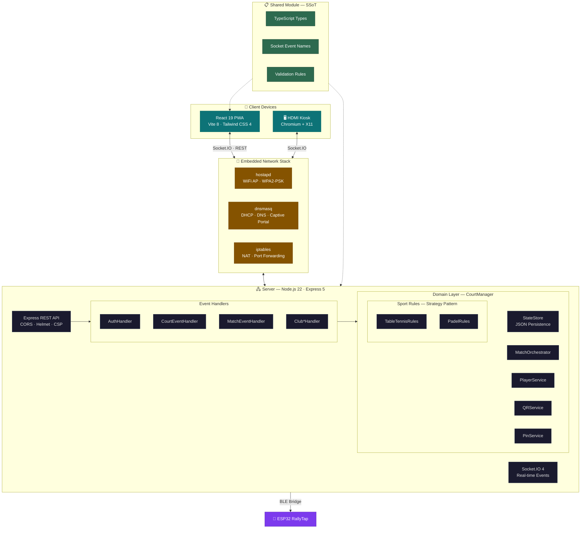
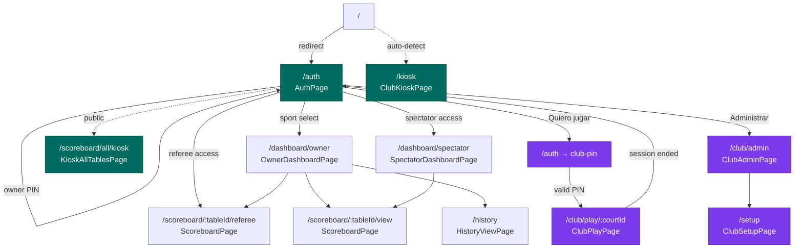

# rallyOS-hub

Real-time scoreboard system for **tournaments** (🏆) and **club play** (🏢) with multi-court support, multi-sport scoring (Table Tennis + Padel), PWA, offline capabilities, and embedded deployment on Orange Pi devices.

## System Architecture

RallyOS Hub is a standalone, real-time scoreboard server optimized for embedded deployment on single-board computers (SBCs) like the Orange Pi Zero 3. It operates as a TypeScript monorepo containing a React-based PWA frontend, an Express + Socket.IO backend, and a shared module serving as the Single Source of Truth (SSoT).

Multi-sport scoring is implemented via the **Strategy pattern** — server-side `SportRules` (TableTennisRules, PadelRules) and client-side `SportDisplayAdapter` — enabling different scoring systems, display layouts, and match configuration per sport.



### Component Breakdown

| Component | Role | Key Technologies |
|-----------|------|-----------------|
| **Client** | React 19 PWA with atomic design. Sport-specific display adapters. BLE bridge for ESP32. i18n (es-AR / en-US). | React 19, Vite 8, Tailwind CSS 4, Framer Motion |
| **Server** | Express 5 + Socket.IO 4 real-time engine. 8 event handlers delegating to domain layer. Multi-sport Strategy pattern. | Node.js 22, Express 5, Socket.IO 4, Pino |
| **Shared** | Single Source of Truth: TypeScript types (discriminated unions), event names, validation rules. | TypeScript 6 |
| **Embedded Stack** | Orange Pi configured as standalone hub with WiFi AP, DHCP/DNS, captive portal, and HDMI kiosk. | hostapd, dnsmasq, iptables, Chromium |

### Embedded Network Stack

| Service | Role | Configuration |
|---------|------|---------------|
| **hostapd** | Broadcasts RallyOS WiFi SSID (`RallyOS-Table1`) | WPA2-PSK, channel 6, 2.4 GHz |
| **dnsmasq** | DHCP (192.168.4.100–200) + DNS (`rallyos.wifi` → 192.168.4.1) | bind-dynamic, catch-all captive portal redirect |
| **iptables** | NAT masquerading, port 80 → 3000 redirect, DNS redirect for Android | Forces all DNS through dnsmasq |
| **Chromium Kiosk** | HDMI display showing scoreboard grid | X11, matchbox-window-manager, hidden cursor |

## Navigation Map



### Role-Based Access

| Role | Unit | Access | Primary Flow |
|------|------|--------|-------------|
| **Owner** | 🏆 | Dashboard, all scoreboards, history, kiosk | Auth → OwnerDashboard |
| **Referee** | 🏆 | Scoreboard with scoring controls | Auth → ScoreboardPage |
| **Spectator** | 🏆 | View-only scoreboard | Auth → SpectatorDashboard |
| **Club Admin** | 🏢 | Court management, pricing, force-end | Auth → "Administrar" → ClubAdmin |
| **Player** | 🏢 | Play on court, view score, end session | Auth → "Quiero jugar" → PIN → ClubPlay |
| **Staff (Kiosk)** | 🏢 | Public court status display | Direct URL `/kiosk` |

## Quick Start

### Prerequisites
- Node.js 22+
- [pnpm](https://pnpm.io/) 9+ (`corepack enable && corepack prepare pnpm@latest --activate`)

### Development
```bash
pnpm install
./scripts/dev.sh
# Client: http://localhost:5173  |  Server: https://localhost:3000
```

### Docker
```bash
./scripts/start.sh
# Access: https://localhost:3000
```

## Orange Pi Deployment

```bash
# One-time setup — everything (Docker, WiFi AP, captive portal, HDMI kiosk)
sudo ./scripts/setup-orangepi-ap.sh

# Start hub
./scripts/start-orange-pi.sh
```

The hub is accessible at:
- **https://rallyos.wifi:3000** (recommended — survives IP changes)
- **https://192.168.4.1:3000** (AP network)
- **https://\<orange-pi-ip\>:3000** (WiFi network)

> Use the domain URL for PWA installation — it survives Orange Pi IP changes.

### Diagnostics
```bash
./scripts/diagnose.sh
```

### Hardware Validation (ESP32)
```bash
# Validates hub → BLE → tournament → club round-trip on real hardware
./scripts/validate-esp32-dual-mode.sh
```

## Testing

```bash
# Client (Vitest)
cd client && pnpm run test

# Server (Jest)
cd server && pnpm run test

# Client E2E (Playwright — local only, disabled in CI)
cd client && pnpm run test:e2e
```

See [`client/README.md`](client/README.md) and [`server/README.md`](server/README.md) for detailed testing guides.

### CI/CD

GitHub Actions runs on push/PR to `main` and `develop`:
- **Client tests**: Vitest unit + coverage
- **Server tests**: Jest unit
- **Build**: Client production build
- **Lint**: ESLint (client + server)

E2E tests are disabled in CI — they require both server + client running simultaneously.

## Project Structure

```
rallyOS-hub/
├── client/          → React 19 PWA (atomic design, BLE bridge, i18n)
├── server/          → Express 5 + Socket.IO 4 (8 handlers, CourtManager, services)
├── shared/          → Types, events, validation (SSoT)
├── scripts/         → Deployment, diagnostics, validation
├── docs/            → Architecture docs (club mode, ESP32, decisions)
├── .github/workflows/ → CI/CD
├── docker-compose.yml
├── Dockerfile
└── .env.example
```

See [`client/README.md`](client/README.md) and [`server/README.md`](server/README.md) for detailed documentation.

## License

MIT
