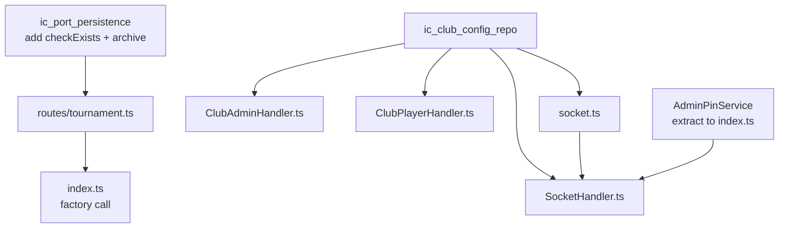

# Exploration: arch-remaining-ports

## Current State

The domain-ports-decoupling SDD has been fully implemented for CourtManager (phases 1-4). Nine port interfaces live under `server/src/domain/ports/`:

| Port | Implemened By | Used By |
|------|--------------|---------|
| ICourtRepository | CourtRepository | CourtManager |
| IPlayerService | PlayerService | CourtManager |
| IMatchOrchestrator | MatchOrchestrator | CourtManager |
| ICourtFormatter | CourtFormatter | CourtManager |
| IPinService | PinService | CourtManager |
| IQRService | QRService | CourtManager |
| IMatchEngineFactory | DefaultMatchEngineFactory | CourtManager |
| ICourtPersistence | StateStore | CourtManager, routes |
| IClubConfigRepository | ClubConfigStore | **Not yet used by handlers** |

CourtManager now receives all deps via `CourtManagerDeps` object in the constructor. The composition root (`index.ts`) wires everything.

However, several files in the **application/infrastructure layer** (handlers, routes) still import and use concrete implementations directly instead of going through the port interfaces.

## Files That Need Changes

### 1. `server/src/routes/tournament.ts` — Mixed StateStore/ICourtPersistence

**Current code:**

- **Line 13:** `import { StateStore } from '../services/store/StateStore';` — imported but only needed by `handleFinish` and `createTournamentRouter`
- **Line 22:** `handleStatus(stateStore: ICourtPersistence, ...)` — ✅ Already uses interface
- **Line 49:** `handleLoad(stateStore: ICourtPersistence, ...)` — ✅ Already uses interface
- **Line 74:** `handleNew(stateStore: ICourtPersistence, ...)` — ✅ Already uses interface
- **Lines 87-103:** `handleFinish(stateStore: StateStore, ...)` — ❌ Uses concrete `StateStore`
  - Uses `stateStore.checkExists()` (line 92)
  - Uses `stateStore.archive()` (line 100)
  - These methods are NOT on `ICourtPersistence`
- **Lines 115-119:** `createTournamentRouter(stateStore: StateStore, ...)` — ❌ Uses concrete `StateStore` (because it passes to `handleFinish`)

**The problem:** `ICourtPersistence` lacks `checkExists()` and `archive()`:
```typescript
// Current ICourtPersistence
save(tournamentCourts, clubCourts): void
load(): PersistedStateV3 | null
clear(): void
```

`StateStore` has additional methods: `checkExists(): boolean` and `archive(): string`.

**Options for the fix:**

**Option A (recommended):** Add `checkExists()` and `archive()` to `ICourtPersistence`. These are part of the tournament lifecycle contract — the app needs to know if state exists and finish+archive it. The interface would become:

```typescript
export interface ICourtPersistence {
  save(tournamentCourts: PersistedCourt[], clubCourts: PersistedClubCourt[]): void;
  load(): PersistedStateV3 | null;
  clear(): void;
  checkExists(): boolean;
  archive(): string;  // Returns the archive path
}
```

Then change `handleFinish` and `createTournamentRouter` to use `ICourtPersistence`. Remove the `StateStore` import entirely.

**Option B:** Keep `handleFinish` and `createTournamentRouter` typed as `StateStore` and only decouple the other three handlers. This is incomplete but avoids touching the port interface.

### 2. `server/src/handlers/ClubAdminHandler.ts` — Concrete ClubConfigStore

**Current code:**

- **Line 12:** `import { ClubConfigStore } from '../services/store/ClubConfigStore';`
- **Line 13:** `import { AdminPinService } from '../services/security/AdminPinService';`
- **Line 24:** `private clubConfigStore: ClubConfigStore;` — ❌ concrete type
- **Line 25:** `private adminPinService: AdminPinService;` — ❌ concrete type
- **Lines 31-32:** `constructor(... clubConfigStore: ClubConfigStore, adminPinService: AdminPinService)` — ❌ concrete types

**Methods used on `clubConfigStore`:**
- `this.clubConfigStore.load()` — defined on `IClubConfigRepository` ✅
- `this.clubConfigStore.save(clubConfig)` — defined on `IClubConfigRepository` ✅

**Methods used on `adminPinService`:**
- `this.adminPinService.verifyPin(data.pin, config.adminPinHash)` (line 64) — NOT on any port interface
- `this.adminPinService.hashPin(data.pin)` (line 123) — NOT on any port interface

**Fix:** 
- Change `ClubConfigStore` to `IClubConfigRepository` (type-only import from `domain/ports`)
- `AdminPinService` has no port interface — needs one if we want to decouple it too

### 3. `server/src/handlers/ClubPlayerHandler.ts` — Concrete ClubConfigStore

**Current code:**

- **Line 13:** `import { ClubConfigStore } from '../services/store/ClubConfigStore';`
- **Line 35:** `private clubConfigStore: ClubConfigStore;` — ❌ concrete type
- **Line 42:** `constructor(... clubConfigStore: ClubConfigStore)` — ❌ concrete type
- **Line 46:** `this.pinRateLimiter = new PinRateLimiter();` — inline concrete rate limiter

**Methods used on `clubConfigStore`:**
- `this.clubConfigStore.load()` (lines 55, 106) — on `IClubConfigRepository` ✅

**Fix:** Change `ClubConfigStore` to `IClubConfigRepository`.

### 4. `server/src/handlers/SocketHandler.ts` — Composition root for handlers

**Current code:**

- **Line 19:** `import { ClubConfigStore } from '../services/store/ClubConfigStore';`
- **Line 20:** `import { AdminPinService } from '../services/security/AdminPinService';`
- **Line 23:** `import { RateLimiter } from '../services/security/RateLimiter';`
- **Line 42:** `private connectionRateLimiter: RateLimiter;`
- **Line 43:** `private clubConfigStore?: ClubConfigStore;` — ❌ concrete type
- **Line 60:** `constructor(... clubConfigStore?: ClubConfigStore)` — ❌ concrete type
- **Line 66:** `this.connectionRateLimiter = new RateLimiter(60_000, 20);` — inline
- **Line 70:** `const adminPinService = new AdminPinService();` — inline
- **Line 78:** `new ClubAdminHandler(io, tableManager, ownerPin, clubConfigStore!, adminPinService)` — passes inline
- **Line 80:** `new ClubPlayerHandler(io, tableManager, ownerPin, clubConfigStore!)` — passes inline
- **Lines 91, 162:** `this.clubConfigStore?.load()` — uses `IClubConfigRepository.load()` ✅

**Fix:** 
- Change `clubConfigStore` type to `IClubConfigRepository` (type-only import)
- Extract `AdminPinService` creation to composition root (index.ts), inject into SocketHandler
- `RateLimiter` is an application-level concern, not domain — keeping it inline is acceptable

### 5. `server/src/socket.ts` — createSocketServer signature

**Current code:**

- **Line 11:** `import { ClubConfigStore } from './services/store/ClubConfigStore';`
- **Lines 15-20:** `function createSocketServer(io, courtManager, ownerPin, hubConfig, clubConfigStore?: ClubConfigStore): SocketHandler`

**Fix:** Change parameter type to `IClubConfigRepository`.

### 6. `server/src/routes/export.ts` — Already decoupled

- **Line 13:** `import type { ICourtPersistence } from '../domain/ports';` — ✅ Already uses the interface
- **Line 25:** `handleExport(stateStore: ICourtPersistence, ...)` — ✅ Already uses interface
- **Line 51:** `createExportRouter(stateStore: ICourtPersistence, ...)` — ✅ Already uses interface

**No changes needed.** ✅

## RateLimiter Gap Analysis

- `SocketHandlerBase.ts` (line 25): `this.rateLimiter = new RateLimiter();` — inline in base class
- `SocketHandler.ts` (line 66): `this.connectionRateLimiter = new RateLimiter(60_000, 20);` — inline
- `ClubPlayerHandler.ts` (line 46): `this.pinRateLimiter = new PinRateLimiter();` — inline

The `RateLimiter` is an application-layer security concern, not a domain port. Handlers are infrastructure. Inlining rate limiters is architecturally acceptable — they are infrastructure compositon, not domain logic.

**Recommendation:** Do NOT create a port for RateLimiter. It's outside the scope of domain-ports decoupling.

## AdminPinService Port Analysis

`AdminPinService` (`services/security/AdminPinService.ts`) has `hashPin(pin): string` and `verifyPin(pin, hash): boolean`. It's used by `ClubAdminHandler`.

This is a security utility service. If we want to decouple it, we'd need an `IAdminPinService` interface in `domain/ports/`. However:

- The handlers are application/infrastructure layer, not domain
- AdminPinService has no IO side effects (pure crypto hashing)
- Creating a port for every service dependency in handlers is over-engineering

**Recommendation:** Extract `AdminPinService` creation to the composition root (index.ts) so it's injected rather than created inline, but do NOT create a port interface for it. This is dependency injection improvement, not domain ports decoupling.

## Test Impacts

### Tests that will NOT break (structural typing works):

| Test File | Change | Impact |
|-----------|--------|--------|
| `tournament.test.ts` | `StateStore implements ICourtPersistence` | ✅ No change needed — passing `StateStore` where `ICourtPersistence` expected works |
| `tournament.integration.test.ts` | Same | ✅ Same |
| `export.test.ts` | Already uses `ICourtPersistence` | ✅ No change |
| `ClubPlayerHandler.test.ts` | `ClubConfigStore implements IClubConfigRepository` | ✅ No change needed |
| `AuthHandler.tournamentToken.test.ts` | No club config dependency | ✅ No change |
| `MatchEventHandler.test.ts` | No club config dependency | ✅ No change |
| `SpotlightHandler.test.ts` | No club config dependency | ✅ No change |

### Tests that need UPDATING if we extract AdminPinService:

None directly — `ClubAdminHandler` is tested via `SocketHandler` in `SpotlightHandler.test.ts` (line 416), which passes `undefined` for `clubConfigStore`. No existing test constructs `ClubAdminHandler` directly.

## Summary of All Changes



| File | What Changes | Risk |
|------|-------------|------|
| `domain/ports/ICourtPersistence.ts` | Add `checkExists()`, `archive()` | Low — additive to interface |
| `domain/ports/__tests__/ports.test.ts` | Add `checkExists`/`archive` to mock implementations | Low |
| `routes/tournament.ts` | Use `ICourtPersistence` everywhere, remove `StateStore` import | Low — structural typing works |
| `handlers/ClubAdminHandler.ts` | Use `IClubConfigRepository` type | Low — pure type change |
| `handlers/ClubPlayerHandler.ts` | Use `IClubConfigRepository` type | Low — pure type change |
| `handlers/SocketHandler.ts` | Use `IClubConfigRepository`, extract `AdminPinService` from inline | Medium — constructor signature changes |
| `socket.ts` | Change parameter type to `IClubConfigRepository` | Low |
| `index.ts` | Create `AdminPinService`, pass to `SocketHandler` | Low |
| `domain/ports/index.ts` | No change needed — `IClubConfigRepository` already exported | None |

## Ready for Proposal
Yes
